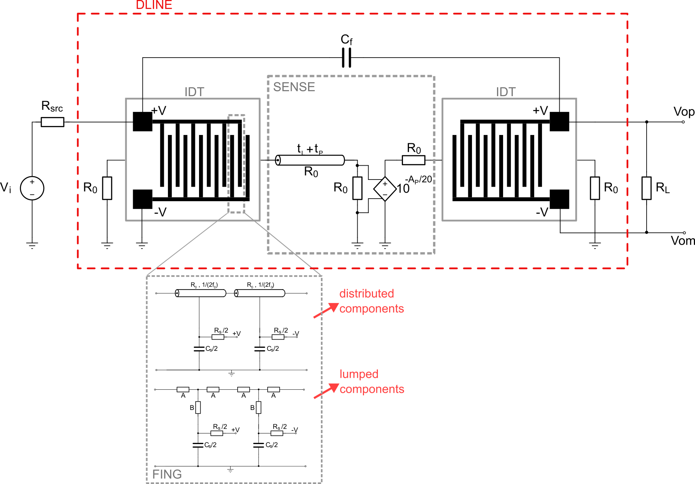

# Surface Acoustic Wave Device SPICE Generator

Script for generating models for surface acoustic wave devices in SPICE. The output is divided in two files, one for the hierarchical blocks (default out.cir) and other for a testbench with a sample circuit and simulation directives (tb.cir). 

## Dependencies

* Python3
* Numpy

## Usage

This software is spread between two python files. While SAW_FUNCTIONS.py carries all the necessary functions for the script, SAW_SPICE_GEN.py is responsible for the model generation. Before running the program, make sure that both files are in the **same folder**. Then, execute it with:

```
python SAW_SPICE.GEN.py
```

If you have more than one python version in your computer, you may need to specify it when running, such as

```
python3 SAW_SPICE.GEN.py
```

Then, the program will ask you to input a few parameters necessary for evaluation of the models. If you are not sure about any of them, you can just press _Enter_ in your keyboard and the software will use default values. The most important parameters, however, are the center frequency (f0) and the number of finger pairs in one IDT, and they must be known if you desire that the model minimally replicates your device's behavior.

When generating the model, the program produces many different hierarchical blocks, according to what is better described in my Master's degree dissertation "MODELAGEM DE DISPOSITIVOS DE ONDAS ACÚSTICAS DE SUPERFÍCIE COM FOCO EM AMBIENTES DE SIMULAÇÃO" or, in english "SIMULATION-ORIENTED MODELLING OF SURFACE ACOUSTIC WAVE DEVICES". Depending on when you read this documentation, it may be easier or harder for this manuscript to be found online, so you can always contact me directly via email.

In the following section, I give a general description of the model created by this script.

## Description of the model

<p align="center">
  
</p>

The final model for the device is contained in the DLINE block, and it can be seen in the figure. Inside of it, there are two IDTs, which themselves are composed of smaller FING models, connected in series, determined by the amount of finger pairs chosen by the user, during the script execution. There are two alternatives for the FING model, the first is the distributed component, which has the best behavior in general, with good frequency and time domain responses and it is the recommended for most uses.

However, you can also use the lumped component model, which approximates the A and B impedances (dependent on the tangent and cosecant of the frequency) with LC pairs through the Foster or Mittag-Leffler theorems. Since this is an approximation of periodic functions, it is necessary to choose how many periods will be approximated (1-5) for Foster or any number >1 for Mittag-Leffler. The lumped component approach results in an unstable model in the time domain simulations, but can still be used in the frequency domain.

The SENSE block, between IDTs, allows for good customization of the response by the user. In that hierarchical block, the values of Ap and tp are defined as parameters, that are controlled by the tb.cir file. By changing these values, the user can freely attenuate or delay the response of the device, which is interesting for simulating perturbations in a sensor. The limitation of this circuit is that Ap can only model **attenuations**, so if you want to increase the gain level, you can change the electroacoustic coupling parameter (K^2) during the execution of the script. 

## Developed at

<p align="center">
  
</p>

by Raphael Cardoso (cardosodeoliveir@gmail.com)

Feel free to contact me via email if you have any questions or there is any bugs in this program.
